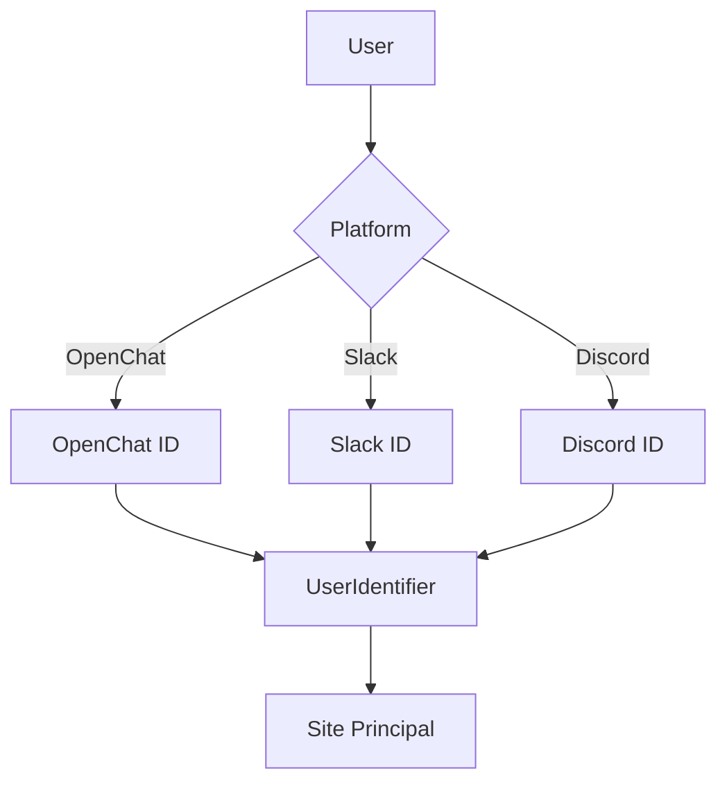
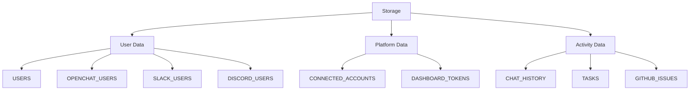
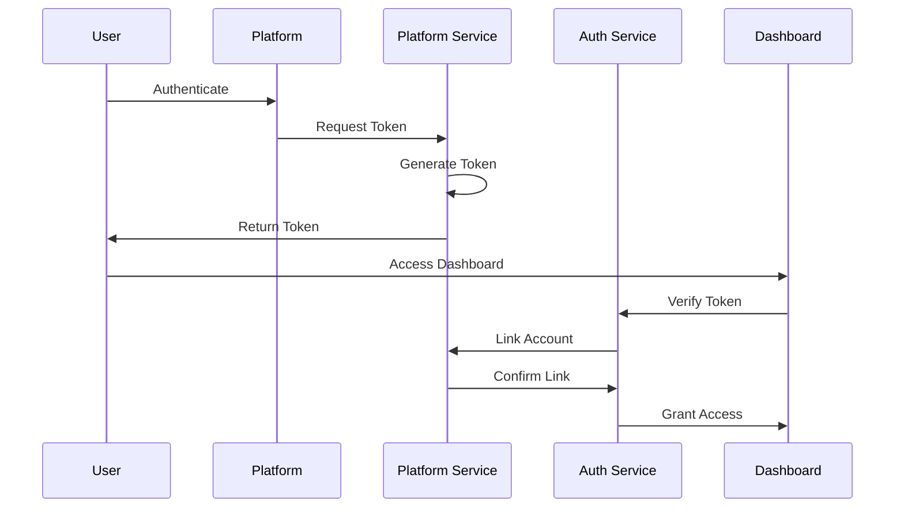
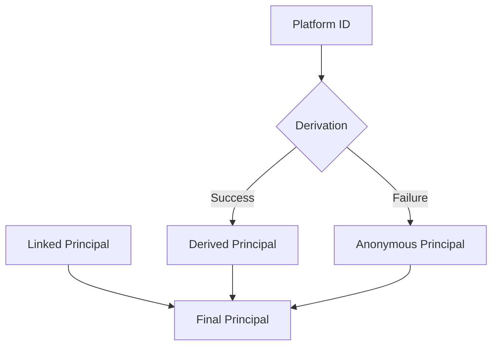
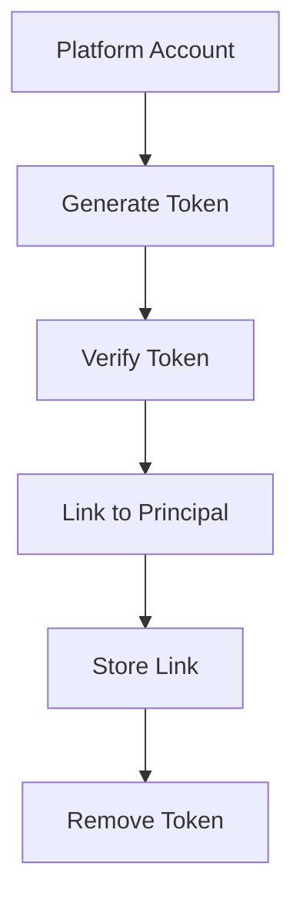

# Backend Architecture Documentation

## Overview
The backend is built on the Internet Computer using Rust and the IC CDK. It provides a multi-platform authentication system that supports OpenChat, Slack, and Discord users, with a unified principal-based identity system.

## Core Components

### 1. User Identification System


#### UserIdentifier Enum
```rust
pub enum UserIdentifier {
    Principal(Principal),
    OpenChatId(String),
    SlackId(String),
    DiscordId(String),
}
```

### 2. Storage System


### 3. Authentication Flow


## Key Services

### 1. Account Service
Handles user account management and activity tracking:
- `store_chat_message`: Stores chat messages
- `store_asana_task`: Stores Asana tasks
- `store_github_issue`: Stores GitHub issues
- `get_user_activity`: Retrieves all user activity
- `get_connection_status`: Checks connected accounts

### 2. Auth Service
Manages authentication and account linking:
- `verify_token`: Validates dashboard tokens
- `link_token_to_principal`: Links platform accounts to site principals
- `get_token_info`: Retrieves token information

### 3. Platform Services
Platform-specific implementations:
- `openchat_service.rs`: OpenChat integration
- `slack_service.rs`: Slack integration
- `discord_service.rs`: Discord integration

## Data Models

### 1. User Models
```rust
// OpenChat User
pub struct OpenChatUser {
    pub openchat_id: String,
    pub site_principal: Option<StablePrincipal>,
    pub first_interaction: u64,
    pub last_interaction: u64,
}

// Slack User
pub struct SlackUser {
    pub slack_id: String,
    pub site_principal: Option<StablePrincipal>,
    pub display_name: Option<String>,
    pub team_id: Option<String>,
}

// Discord User
pub struct DiscordUser {
    pub discord_id: String,
    pub site_principal: Option<StablePrincipal>,
    pub username: Option<String>,
    pub guild_id: Option<String>,
}
```

### 2. Activity Models
```rust
pub struct UserActivity {
    pub chat_history: Vec<ChatMessage>,
    pub tasks: Vec<Task>,
    pub issues: Vec<Issue>,
    pub connection_status: ConnectionStatus,
}
```

## Principal Management

### 1. Principal Derivation


### 2. Account Linking


## Error Handling

### 1. Token Errors
- Expired tokens
- Invalid tokens
- Already used tokens

### 2. Account Errors
- Already linked accounts
- Non-existent users
- Invalid platform IDs

### 3. Storage Errors
- Serialization failures
- Deserialization failures
- Storage capacity issues

## Security Considerations

### 1. Token Security
- Short expiration time (2 minutes)
- Single-use tokens
- Secure random generation
- Immediate removal after use

### 2. Account Protection
- One-to-one mapping between platform IDs and principals
- Verification before linking
- Platform-specific ID validation

### 3. Data Access
- Principal-based access control
- Cross-platform data isolation
- Secure storage of sensitive data

## Best Practices

### 1. Code Organization
- Separate platform-specific logic
- Consistent error handling
- Clear function documentation
- Type-safe implementations

### 2. Performance
- Efficient storage access
- Minimal cross-canister calls
- Optimized data structures
- Proper memory management

### 3. Testing
- Unit tests for core functionality
- Integration tests for platform services
- Error case coverage
- Performance benchmarks

## Future Considerations

### 1. Scalability
- Storage optimization
- Performance monitoring
- Load balancing
- Caching strategies

### 2. New Features
- Additional platform support
- Enhanced security measures
- Improved error handling
- Better monitoring tools

### 3. Maintenance
- Regular security audits
- Performance optimization
- Code refactoring
- Documentation updates 